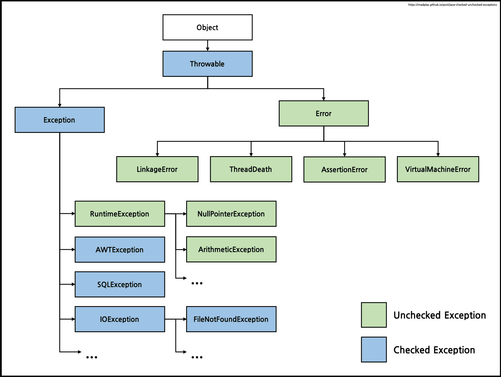

# 🎁 **예외**

<br>

## **⭐️ 아이템 69 : 예외는 진짜 예외 상황에만 사용하라**

다음 두 코드를 보자 
```JAVA
try {
    int i = 0;
    while (true)
        range[i++].climb();
} catch (ArrayIndexOutOfBoundsException e) {
}
```
```java
for (Mountain m : range)
    m.climb();
```

두 코드 모두 같은 동작을 하는데 첫 번째는 예외를 이용해서 루프를 종료하였고, 두 번째는 배열의 끝에 도달하면 종료한다. 둘 다 같은 기능을 하지만 첫 번째 방법은 전혀 직관적이지 못하고 끔찍하다.  
이러한 문제는 세가지 관점에서 잘못되었다. 

1. 예외는 예외 상황에 쓸 용도로 설계되었으므로 JVM 구현자 입장에서는 명확한 검사만큼 빠르게 만들어야 할 동기가 약하다(최적화에 별로 신경 쓰지않았을 가능성이 크다.)
2. 코드를 try-catch 브록 안에 넣으면 JVM이 적용할 수 있는 최적화가 제한 된다.
3. 배열을 순회하는 표준 과뇽ㅇ구는 앞서 걱정한 중복 검사를 수행하지 않는다. JVM이 알아서 최적화해 없애준다.  

예외는 오직 예외 상황에서만 써야 한다. 절대로 일상적인 제어 흐름용으로 쓰여선 안 된다.  

잘 설계된 API라면 클라이언트가 정상적인 제어 흐름에서 예외를 사용할 일이 없게 해야 한다.

<br>

## **⭐️ 아이템 70 : 복구할 수 있는 상황에는 검사 예외를, 프로그래밍 오류에는 런타임 예외를 사용하라**

### 에러
에러는 크게 나누면 컴파일 에러와 런타임 에러가 있다. 컴파일 과정에서 에러가 일어나면 컴파일 에러이고, 실행과정에서 에러가 일어나면 런타임 에러이다.  

컴파일 에러는 컴파일러가 문법 검사를 통해 오류를 잡아낸다.  
컴파일 과정에서 에러가 나지 않더라도 Runtime시 오류가 발생할 수 있는데 Runtime시 오류는 프로그래머가 직접 핸들링할 수 있어야 한다. Java에서는 런타임 에러를 Exception와 Error로 구분하고 있다.  

Error는 StackOverflowError나 OutOfMemoryError 처럼 Jvm에서 문제가 생기거나 하드웨어 문제가 생기는 경우이다. 이 경우 프로그래머는 미리 대비하여야 한다.  

Exception은 프로그램의 문제로 발생하는 경우인데 마찬가지로 프로그래머는 미리 적절하게 대비하여야 한다.  

### ***Checked Exception vs Unchecked Exception***


<div style="background-color:white;">
    
</div>

<br>

위 그림처럼 Exception을 포함한 파란색은 Checked Exception 이고, RuntimeException, Error를 포함한 초록색은 Unchecked Exception으로 볼 수 있다.  

두 가지의 차이는 복구 가능성이 있느냐, 복구 가능성이 없느냐의 차이로 볼 수 있다. 
따라서 Checked Exception은 복구 가능성이 있기 때문에 예외를 처리하는 코드를 작성해야 하고, Unchecked Exception은 복구 가능성이 없는 예외이므로 예외처리를 강제하지 않는다.


위 그림과 같이 Checked Exception은 예외 처리를 강제하고, Unchecked Exception은 예외처리를 강제하지 않는 것을 볼 수 있다.

```java
public void throwException() throws Exception {
    throw new Exception();
}
```
따라서 위와 같이 예외를 바깥으로 던져주거나 그 자리에서 처리해주어야 한다.  

### ***언제 Checked Exception Unchecked Exception을 사용할까?***
호출하는 쪽에서 복구하리라 여겨지는 상황이라면 Checked Exception을 사용하자.  
프로그래밍 오류를 나타낼 때는 RuntimeException를 사용하자.  
Error 클래스를 상속해 하위 클래스를 만드는 일은 자제하자.  
Throwable은 절대 사용하지 말자.  

```
스프링 프레임워크가 제공하는 선언적 트랜잭션(@Transactional)안에서 에러 발생 시 Checked Exception는 롤백이 되지 않고, Unchecked Exception는 롤백이 된다.  
하지만 rollbackFor 옵션을 통해서 위 상황을 바꿀 수 있다.
```

<br>

## **⭐️ 아이템 71 : 필요 없는 검사 예외 사용은 피하라**


<br>

## **⭐️ 아이템 72 : 표준 예외를 사용하라**

<br>

## **⭐️ 아이템 73 : 추상화 수준에 맞는 예외를 던지라**

<br>

## **⭐️ 아이템 74 : 메서드가 던지는 모든 예외를 문서화하라**

<br>

## **⭐️ 아이템 75 : 예외의 상세 메시지에 실패 관련 정보를 담으라**

<br>

## **⭐️ 아이템 76 : 가능한 한 실패 원자적으로 만들라**

<br>

## **⭐️ 아이템 77 : 예외를 무시하지 말라**


